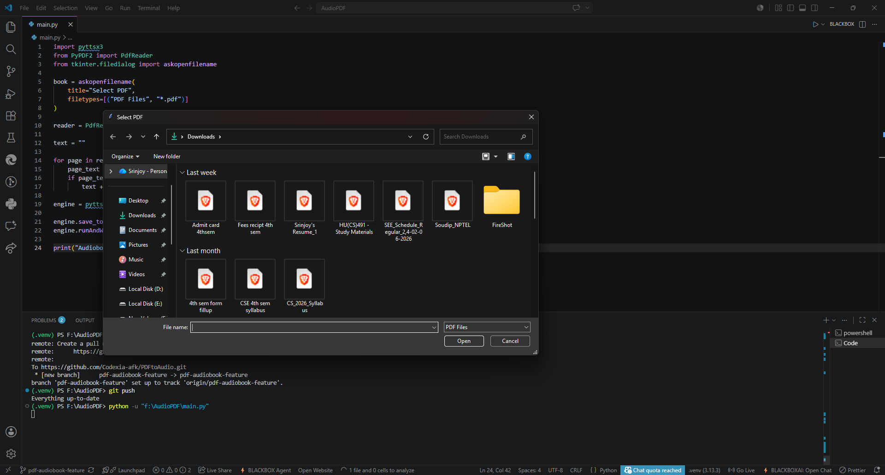

# 📚 PDF to Audiobook Converter

Convert PDF documents into spoken audio using Python and Text-to-Speech technology.

## 🚀 Overview

PDF to Audiobook Converter is a Python-based project that allows users to select a PDF file and convert its text content into speech. The application extracts text from PDF pages and reads it aloud using a Text-to-Speech engine, making it useful for students, readers, and accessibility purposes.

This project was initially developed as a desktop-based Python application and is planned to be extended into a full web application.

## ✨ Features

* Select and process PDF files
* Extract text from PDF documents
* Convert text into speech
* Simple and lightweight implementation
* Beginner-friendly Python project
* Useful for accessibility and audiobook generation

## 🛠️ Technologies Used

* Python
* PyPDF2
* pyttsx3
* Tkinter

## 📦 Installation

Clone the repository:

```bash
git clone https://github.com/your-username/pdf-to-audiobook.git
cd pdf-to-audiobook
```

Install dependencies:

```bash
pip install -r requirements.txt
```

Run the application:

```bash
python main.py
```

## 📋 How It Works

1. Launch the application.
2. Select a PDF file from your computer.
3. The application extracts text from the PDF.
4. The text is converted into speech.
5. The audiobook is played or saved based on the implementation.

## 🔮 Future Improvements

Planned upgrades include:

* Web-based interface
* Drag-and-drop PDF upload
* Download generated audiobooks as MP3
* Multiple voice options
* Adjustable speech speed
* Dark mode UI
* User authentication
* Cloud storage support

### 🌍 Multi-Language Support (Planned)

The future web application will support audiobook generation in multiple languages, including:

* English
* Hindi
* Bengali
* Sanskrit
* And many other languages

Users will simply upload a PDF, choose their preferred language, and generate an audiobook with a single click.


### PDF Selection Interface



The application allows users to select any PDF document from their system and convert it into an audiobook using Text-to-Speech technology.

## 🤝 Contributing

Contributions, suggestions, and feature requests are welcome.

## 📄 License

This project is licensed under the MIT License.

## 👨‍💻 Author

Developed by Codexia_afk as a learning project to explore PDF processing, text extraction, and Text-to-Speech technologies in Python.
