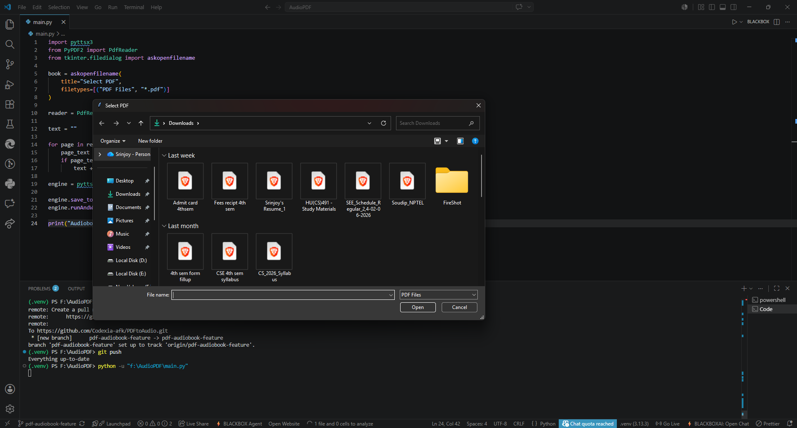

# 🎧 PDFtoAudio — Accessible AI Learning & Document Platform

> Turn any document into an accessible lesson you can listen to, understand, and remember.



---

## 🌟 Vision & Positioning

PDFtoAudio is an accessible, privacy-conscious AI learning and document audio platform that transforms PDFs, textbooks, research papers, and documents into interactive audio lessons, grounded Q&A study tools, and customizable revision materials.

---

## ✨ Core Feature Highlights

### 📚 1. Document Library & Resume Playback
* **Multi-Format Upload**: Upload PDFs, DOCX, TXT, Markdown, and EPUB files.
* **Metadata Index**: Total page count, word count, estimated listening time, and parser quality reports.
* **Resume Playback**: Automatically saves your exact sentence position and playback timestamp.
* **Bookmarks & Notes**: Save highlights, notes, and sentence bookmarks.

### 🧠 2. Educational Study Suite
* **6 Summary & Explanation Modes**:
  * 📋 *Quick Overview*
  * 🔒 *Strict Read Mode* (Narration without AI paraphrasing)
  * 🔬 *Educational Deep Dive*
  * 💡 *Explain Simply (ELI5)*
  * 🎓 *Professor Analysis*
  * ⚛️ *Feynman Learning Technique*
* **Interactive Revision Flashcards**: Click-to-flip flashcards with difficulty levels and page-number citations.
* **Anki CSV Export**: Export flashcards directly to `.csv` format for Anki spaced-repetition software.
* **Multiple-Choice Quizzes**: Interactive assessments with instant score feedback and explanatory citations.

### 💬 3. Trust Mode & Document Chat
* **Grounded Document Q&A**: Ask any question about your document.
* **Page-Level Citations**: Answers are strictly grounded in document text with clickable page-number references (`Page 2`, `Page 5`).
* **Unverified Fallback**: Clearly displays *"Not found in document"* when evidence is missing.
* **Text-to-Speech Answer Conversion**: Listen to any chat response instantly.

### ♿ 4. Accessibility Mode (WCAG 2.1 AA)
* **Dyslexia-Friendly Font**: Full built-in support for `OpenDyslexic`.
* **High Contrast Theme**: High-visibility dark theme for visually impaired users.
* **Text Scaling**: Normal, Large (120%), and Extra Large (150%) display scaling.
* **Full Keyboard Navigation**: Visible focus outlines (`:focus-visible`) and complete keyboard controls:
  * <kbd>Space</kbd> / <kbd>K</kbd>: Play / Pause
  * <kbd>M</kbd>: Mute / Unmute
  * <kbd>?</kbd>: Accessibility Drawer
* **Sentence & Word Karaoke Highlighting**: Visual sentence highlighting synced with audio playback.

### 🎙️ 5. Neural Audio & Podcast Engine
* **50+ Neural AI Voices**: High-definition voices across English, Hindi, Bengali, Spanish, French, German, Japanese, etc.
* **2-Host AI Podcast Mode**: Synthesizes an episode featuring **Alex** (Male Storyteller) and **Sam** (Female Studio Host) with page citations.
* **Pronunciation Dictionary**: Custom replacements for technical terms, acronyms, and formulas.
* **RSS Podcast Feed**: Generate valid RSS 2.0 XML feeds (`/api/documents/{id}/rss`) for Apple Podcasts, Spotify, and Pocket Casts.

---

## 🛠️ Architecture & Backend Services

```
backend/
├── app.py              # FastAPI Web Application & REST API routes
├── parser_service.py   # Multi-format document parser & Quality Reports
├── ocr_service.py      # Scanned PDF detection & Tesseract OCR pipeline
├── storage_service.py  # Local persistent Library CRUD, Metadata & Bookmarks
├── tts_engine.py       # Neural TTS Engine (edge-tts + gTTS + Pronunciation Dictionary)
├── podcast_engine.py   # 2-Host AI Podcast Generator with Citations
├── summary_service.py  # Educational Summary Engine (6 Modes)
├── quiz_service.py     # Flashcards, Quizzes & Anki CSV Exporter
├── chat_service.py     # Grounded Q&A Chat Engine with Page Citations
├── export_service.py   # Subtitles (.VTT/.SRT) & RSS Podcast Feed Generator
├── task_service.py     # Non-blocking async background job queue
└── schemas.py          # Pydantic data schemas
```

---

## 🚀 Quick Start

1. **Install Python dependencies:**
   ```bash
   pip install -r requirements.txt
   ```

2. **Launch the Application:**
   ```bash
   python main.py
   ```
   This boots the server at `http://127.0.0.1:8000` and opens your browser.

3. **Run Automated Test Suite:**
   ```bash
   python3 -m unittest discover tests
   ```

---

## 🔌 API Reference

| Method | Endpoint | Description |
| :--- | :--- | :--- |
| `GET` | `/` | Web Studio Application |
| `GET` | `/api/voices` | Returns list of available AI voices |
| `POST` | `/api/upload` | Upload document to Library & extract metadata/chapters |
| `GET` | `/api/documents` | List all documents in Library |
| `GET` | `/api/documents/{id}` | Get metadata and content for a document |
| `POST` | `/api/documents/{id}/playback` | Save last played sentence index & timestamp |
| `DELETE` | `/api/documents/{id}` | Delete document from Library |
| `POST` | `/api/documents/{id}/summary` | Generate educational summary across 6 modes |
| `POST` | `/api/documents/{id}/study` | Generate flashcards and quiz questions |
| `GET` | `/api/documents/{id}/anki-csv` | Download flashcards in Anki CSV format |
| `POST` | `/api/documents/{id}/chat` | Grounded Q&A chat with page citations |
| `GET` | `/api/documents/{id}/rss` | Download RSS Podcast Feed XML |

---

## 📄 License & Security

Distributed under the MIT License. Developed by **Codexia_afk**.
See [SECURITY.md](file:///Users/srinjoypramanick/PDFtoAudio/SECURITY.md) and [ACCESSIBILITY.md](file:///Users/srinjoypramanick/PDFtoAudio/ACCESSIBILITY.md) for data protection and conformance statements.
